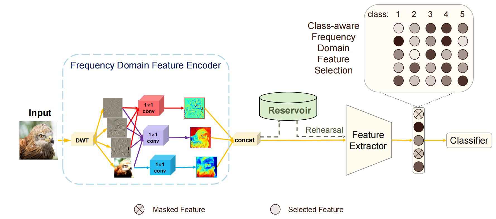
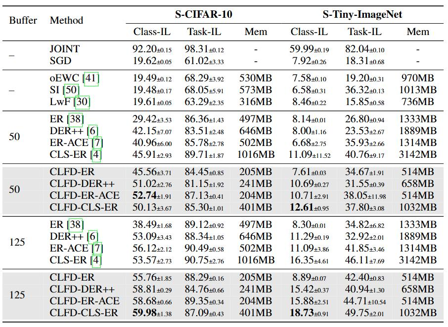
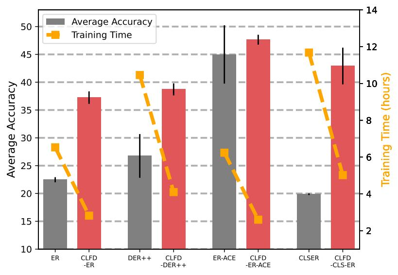

# Continual Learning in the Frequency Domain

[](https://arxiv.org/abs/2410.06645)

The official repository for [NeurIPS'24 paper](https://arxiv.org/abs/2410.06645) "Continual Learning in the Frequency Domain".

###  Overview

We employ the Discrete Wavelet Transform (DWT) to map the original image into the frequency domain and selectively utilize frequency domain features. The framework process is outlined as follows:
<div align="center">

</div>
Our framework can improve the accuracy of state-of-the-art (SOTA) continual learning methods by up to 6.83% and reduce training time by 2.6×. The main experimental results are as follows:

<div align="center">

</div>
<div align="center">

</div>

## Setup

+ Use argument `--load_best_args` to use the best hyperparameters from the paper.
+ New models can be added to the `models/` folder.
+ New datasets can be added to the `datasets/` folder.

### 🚀Quick Start
- Use `./utils/main.py` to run experiments.
- To reproduce the results in the paper run the following  

    `python utils/main.py --dataset <dataset> --model <model> --buffer_size <buffer_size> --load_best_args`
- For example, for dataset Seq-CIFAR10, run \
    `python utils/main.py --dataset seq-cifar10 --model er_clfd --buffer_size 50 --load_best_args`
  
## Acknowledgements
We extended the original repo [DER++](https://papers.nips.cc/paper/2020/hash/b704ea2c39778f07c617f6b7ce480e9e-Abstract.html) with our method.
We extend our gratitude to the authors for their support and for providing the research community with the Mammoth framework.

## Citing this work
If you find the project helpful, please consider citing our paper:
```bibtex
@article{liu2024continual,
  title={Continual learning in the frequency domain},
  author={Liu, RuiQi and Diao, Boyu and Huang, Libo and An, Zijia and An, Zhulin and Xu, Yongjun},
  journal={Advances in Neural Information Processing Systems},
  volume={37},
  pages={85389--85411},
  year={2024}
}
```